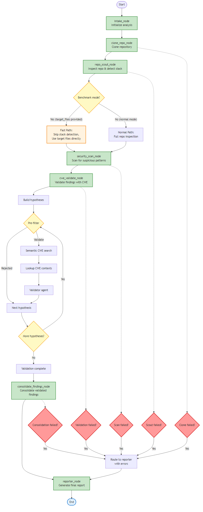
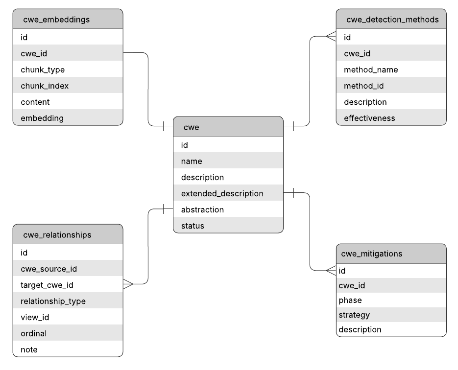
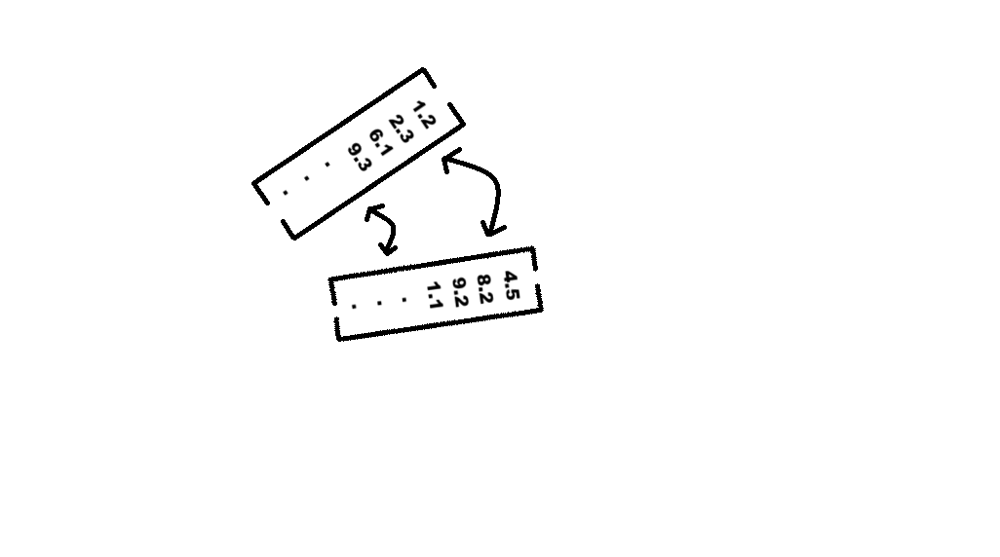

Tomé tu README actual y le añadí la parte de arquitectura, flujo repo-céntrico, base de conocimiento, evaluación y uso de las imágenes de `evidence/` para que funcione como documento de ejecución **y** de comprensión del sistema. La estructura y los componentes que describo son consistentes con tu borrador y con el documento de tesis. 


# LangGraph Thesis Project

## Descripción general

Este proyecto implementa una arquitectura repo-céntrica para el análisis estático de repositorios públicos de GitHub con el objetivo de detectar señales de vulnerabilidad, construir hipótesis de debilidad y clasificarlas en términos de **Common Weakness Enumeration (CWE)** mediante recuperación semántica y validación asistida por modelos de lenguaje open source.

La solución está compuesta por varios servicios desacoplados:

- un contenedor **sandbox** para clonar repositorios públicos,
- una aplicación principal **langgraph-app** que ejecuta el flujo de análisis,
- una base de datos **PostgreSQL + pgvector** que almacena conocimiento CWE y resultados de benchmark,
- un entorno **Ollama** para embeddings y validación con LLM,
- y un contenedor **pgAdmin** para inspección manual de la base de datos.

El objetivo del sistema no es ejecutar código del repositorio objetivo, sino **tratarlo únicamente como texto fuente para análisis estático**.

---

## Qué hace el sistema

Dado un repositorio de GitHub o un archivo específico de benchmark, el sistema:

1. clona el repositorio dentro del contenedor `sandbox`,
2. inspecciona el proyecto y selecciona archivos candidatos,
3. detecta patrones sospechosos en el código,
4. transforma esas señales en hipótesis de vulnerabilidad,
5. recupera CWEs candidatos mediante búsqueda semántica sobre embeddings,
6. aplica un pre-filtro barato para eliminar falsos positivos obvios,
7. valida la hipótesis con un agente basado en LLM,
8. consolida los hallazgos aceptados,
9. y devuelve una salida estructurada persistible para evaluación experimental.

---

## Arquitectura visual

### Arquitectura general


Esta figura resume la idea principal del sistema: una entrada de repositorio, un entorno aislado para almacenamiento del código, una aplicación LangGraph que orquesta el análisis y una base de conocimiento CWE que sirve como capa de recuperación y apoyo a la clasificación.

### Infraestructura dockerizada


Esta figura muestra la separación entre contenedores y responsabilidades. El contenedor `sandbox` maneja el clonado, `langgraph-app` ejecuta el flujo de trabajo, la base PostgreSQL almacena conocimiento y resultados, y Ollama realiza embeddings y validación.

### Flujo repo-céntrico


Esta figura ilustra la lógica principal del pipeline: exploración del repositorio, selección de archivos, detección de patrones, construcción de hipótesis, recuperación de CWE, validación y consolidación de hallazgos.

### Grafo de workflow



Esta imagen representa la estructura lógica del flujo implementado en LangGraph.

### Base de conocimiento CWE



Este diagrama resume la estructura lógica de la base de datos CWE, incluyendo tablas principales, relaciones, mitigaciones, métodos de detección y embeddings.

### Recuperación semántica



Esta figura ayuda a interpretar la idea de recuperación semántica: las hipótesis construidas desde el código se convierten en consultas semánticas y se comparan contra vectores de CWE para recuperar candidatos cercanos conceptualmente.

### Vista general de contenedores


---

## Cómo funciona internamente

## 1. Entrada del sistema

La entrada principal es una URL de GitHub, por ejemplo:

```bash
https://github.com/usuario/repositorio.git
````

Opcionalmente, en modo benchmark, la ejecución puede restringirse a uno o más archivos concretos mediante `target_files`.

---

## 2. Clonado y aislamiento

El clonado del repositorio se realiza en el contenedor `sandbox`.
Esto cumple dos propósitos:

* aislar el contenido externo del resto del sistema,
* y evitar que el repositorio objetivo sea ejecutado.

El repositorio clonado se guarda en un volumen compartido y luego es tratado únicamente como entrada textual.

---

## 3. Exploración repo-céntrica

Una vez clonado, el workflow analiza la estructura del proyecto:

* inspecciona el árbol del repositorio,
* detecta el stack predominante,
* y selecciona archivos candidatos para análisis.

En evaluación de benchmark, si se pasan `target_files`, el sistema activa un **benchmark fast path** y evita la exploración completa del repositorio, trabajando solo sobre los archivos indicados.

---

## 4. Detección de patrones sospechosos

La herramienta `SuspiciousPatternTool` recorre los archivos candidatos y aplica reglas basadas en expresiones regulares y heurísticas para detectar señales de interés, por ejemplo:

* construcción dinámica de consultas SQL,
* sinks de ejecución de comandos,
* acceso a rutas/archivos,
* credenciales embebidas,
* almacenamiento inseguro del lado cliente,
* sinks DOM XSS,
* deserialización insegura.

El resultado de esta etapa son **raw findings**, que todavía no son hallazgos finales.

---

## 5. Construcción de hipótesis

La clase `HypothesisBuilder` transforma cada señal cruda en una hipótesis estructurada con:

* `hypothesis_type`,
* `candidate_cwes`,
* ubicación del archivo,
* línea de evidencia,
* severidad tentativa,
* y una explicación corta del motivo de sospecha.

Ejemplo conceptual:

* señal: `sql_query_concatenation`
* hipótesis resultante: `sql_injection_signal`
* candidatos iniciales: `CWE-89`

---

## 6. Recuperación semántica sobre CWE

Después de construir una hipótesis, el sistema genera una consulta semántica usando la evidencia encontrada y la utiliza para buscar CWE candidatos en la base PostgreSQL con `pgvector`.

La recuperación semántica no decide la clasificación final; su propósito es **reducir el espacio de búsqueda** y entregar al agente validador un conjunto pequeño de CWEs plausibles.

---

## 7. Pre-filtro de hipótesis

Antes de llamar al agente validador, el sistema aplica un `HypothesisPreFilter`.

Esta capa sirve para rechazar casos obviamente seguros o irrelevantes sin costo de LLM, por ejemplo:

* PreparedStatements que usan placeholders y binding seguro,
* comandos completamente literales sin evidencia de influencia externa,
* contextos de path handling con señales visibles de validación o normalización,
* casos cliente-servidor donde no existe evidencia de relevancia de seguridad.

---

## 8. Validación con LLM

La clase `CWEValidatorAgent` utiliza un modelo open source ejecutado localmente con Ollama para validar una sola hipótesis a la vez.

Entradas del validador:

* contexto del proyecto,
* hipótesis sospechosa,
* fragmento local de código,
* candidatos CWE recuperados.

Salida del validador:

* `validated`,
* `rejected`,
* o `needs_review`,
* junto con el `final_cwe_id`, confianza y una justificación breve.

Esta es la principal etapa de razonamiento semántico del sistema.

---

## 9. Consolidación de hallazgos

Los hallazgos aceptados por el validador se agrupan y consolidan en una salida final estructurada, lista para:

* inspección manual,
* persistencia en base de datos,
* evaluación experimental,
* cálculo de métricas,
* y análisis de errores.

---

## 10. Evaluación experimental

Para benchmark, el proyecto usa **OWASP Benchmark Java** y scripts de evaluación que:

* seleccionan subconjuntos de casos,
* ejecutan el workflow por archivo,
* almacenan resultados persistentes,
* permiten reanudación por `run_label`,
* calculan métricas,
* y exportan falsos positivos / falsos negativos.

---

## Estructura principal del repositorio

* `docker-compose.yml`: define todos los servicios del sistema.
* `databases/cve-db/init/`: scripts SQL de inicialización de la base.
* `datasets/cwec_v4.19.1.xml`: dataset CWE de MITRE utilizado para la carga.
* `evidence/`: imágenes y diagramas del sistema.
* `langgraph-app/`: aplicación principal.
* `langgraph-app/src/graph/workflow.py`: flujo principal de análisis.
* `langgraph-app/src/tools/`: herramientas determinísticas.
* `langgraph-app/src/agents/`: agentes basados en LLM.
* `langgraph-app/src/services/`: servicios auxiliares como hipótesis y pre-filtros.
* `langgraph-app/src/ingestion/`: scripts para cargar CWE y embeddings.
* `langgraph-app/src/evaluation/`: scripts de benchmark, métricas y análisis de errores.

---

## Requisitos previos

1. Docker y Docker Compose instalados.
2. Python 3.11 disponible en el host si deseas correr scripts fuera de contenedores.
3. Conexión a internet para:

   * clonar repositorios GitHub,
   * descargar dependencias,
   * y descargar modelos en Ollama.

---

## Instalación de dependencias

### Dependencias desde la raíz

```bash
python -m venv .venv
.\.venv\Scripts\activate
pip install -r requirements.txt
```

### Dependencias de `langgraph-app`

```bash
python -m venv .venv
.\.venv\Scripts\activate
pip install -r langgraph-app/requirements.txt
```

> Nota: el contenedor `langgraph-app` instala automáticamente sus dependencias al construirse.

---

## Levantar el proyecto con Docker Compose

Desde la raíz del proyecto:

```bash
docker compose up -d --build
```

Esto levanta:

* `cve-db-tesis-3`: PostgreSQL con `pgvector`,
* `sandbox-tesis-3`: clonado controlado de repositorios,
* `pgadmin-tesis-3`: administración visual de PostgreSQL,
* `langgraph-app-tesis-3`: aplicación principal con Ollama y LangGraph.

Verificar estado:

```bash
docker compose ps
```

---

## Modelos open source usados

El proyecto utiliza Ollama para dos tareas:

* **Embeddings**: `mxbai-embed-large`
* **Validación LLM**: `qwen2.5:7b`

### Instalar modelos dentro del contenedor

```bash
docker exec -it langgraph-app-tesis-3 bash
ollama pull qwen2.5:7b
ollama pull mxbai-embed-large
ollama list
```

### Cambiar modelos

Si se desea experimentar con otros modelos:

1. instalar el modelo con `ollama pull`,
2. actualizar la referencia en:

   * `langgraph-app/src/ingestion/load_cwe_embeddings.py`
   * `langgraph-app/src/agents/cwe_validator.py`
3. reiniciar el contenedor o volver a ejecutar el flujo.

---

## Cargar el conocimiento CWE

## 1. Cargar el núcleo CWE

```bash
python langgraph-app/src/ingestion/load_cwe_core.py
```

Este script:

* parsea `datasets/cwec_v4.19.1.xml`,
* carga debilidades principales,
* relaciones,
* mitigaciones,
* y métodos de detección.

Tablas principales pobladas:

* `cwe`
* `cwe_relationships`
* `cwe_mitigations`
* `cwe_detection_methods`

## 2. Generar embeddings

```bash
python langgraph-app/src/ingestion/load_cwe_embeddings.py
```

Este script:

* construye texto enriquecido por CWE,
* genera embeddings con `mxbai-embed-large`,
* y los inserta en `cwe_embeddings`.

## 3. Completar embeddings faltantes

```bash
python langgraph-app/src/ingestion/load_missing_cwe_embeddings_fallback.py
```

---

## Otros scripts útiles de ingestión

* `preview_cwe_core.py`: vista preliminar de registros parseados desde el XML.
* `preview_cwe_embedding_text.py`: muestra el texto construido para embeddings.
* `test_cwe_db_connection.py`: valida conectividad y contenido de la base.
* `test_cwe_semantic_search.py`: prueba la búsqueda vectorial sobre CWE.

---

## Ejecutar el workflow sobre un repositorio

El contenedor `langgraph-app-tesis-3` se mantiene activo, pero el análisis no corre automáticamente como servicio web.
La forma correcta de ejecutar análisis es invocando directamente `MultiAgentWorkflow`.

### Ejecución normal

```bash
docker exec -it langgraph-app-tesis-3 python -c "import json; from src.graph.workflow import MultiAgentWorkflow; result = MultiAgentWorkflow().run('https://github.com/usuario/repositorio.git'); print(json.dumps(result, indent=2, default=str))"
```

### Qué hace esta ejecución

* clona el repositorio,
* explora su estructura,
* selecciona archivos candidatos,
* detecta patrones sospechosos,
* construye hipótesis,
* recupera CWE candidatos,
* valida con LLM,
* y consolida hallazgos.

---

## Ejecutar archivos específicos con `target_files`

Esto activa el modo controlado tipo benchmark:

```bash
docker exec -it langgraph-app-tesis-3 python -c "import json; from src.graph.workflow import MultiAgentWorkflow; result = MultiAgentWorkflow().run('https://github.com/usuario/repositorio.git', target_files=['src/main/java/org/owasp/benchmark/testcode/Example.java']); print(json.dumps(result, indent=2, default=str))"
```

Con `target_files`, el flujo evita la exploración completa y analiza únicamente los archivos indicados.

---

## Ejecutar benchmark con OWASP Benchmark Java

El script preparado para benchmark es:

```text
langgraph-app/src/evaluation/run_benchmark_subset.py
```

### Uso básico

```bash
docker exec -it langgraph-app-tesis-3 python -m src.evaluation.run_benchmark_subset --run-label my_benchmark_run
```

### Parámetros importantes

* `--run-label`: etiqueta obligatoria de la corrida.
* `--benchmark-json`: JSON del benchmark a usar.
* `--repo-url`: URL del repositorio de benchmark.
* `--category`: filtra por categoría.
* `--real-vulnerability`: `true`, `false` o `none`.
* `--limit`: número máximo de casos.
* `--force-rerun`: reejecuta aunque ya existan resultados.
* `--cwe-id`: filtra por CWE específico.

### Ejemplo

```bash
docker exec -it langgraph-app-tesis-3 python -m src.evaluation.run_benchmark_subset --run-label benchmark_pathtraver --category pathtraver --real-vulnerability true --limit 20
```

---

## Calcular métricas

El proyecto incluye un script para calcular métricas a partir de las corridas persistidas:

```bash
python -m src.evaluation.compute_metrics --run-labels nombre_de_corrida
```

Ejemplo:

```bash
python -m src.evaluation.compute_metrics --run-labels cwe22_all_v2
```

El script puede reportar:

* TP
* FP
* FN
* TN
* precision
* recall
* F1
* accuracy
* specificity

y, en algunas configuraciones, también métricas family-aware.

---

## Exportar falsos positivos y falsos negativos

Para análisis de errores:

```bash
python -m src.evaluation.export_misclassified_cases --run-labels cwe22_all_v2 --error-type fp --limit 10 --include-raw-result
```

o

```bash
python -m src.evaluation.export_misclassified_cases --run-labels cwe22_all_v2 --error-type fn --limit 10 --include-raw-result
```

Esto permite inspeccionar:

* evidencia detectada,
* hipótesis construidas,
* salida del validador,
* hallazgos consolidados,
* y trazas del workflow.

---

## Persistencia de resultados

Las corridas de benchmark se almacenan en PostgreSQL.
Las tablas de evaluación incluyen al menos:

* `benchmark_runs`
* `benchmark_case_results`

Esto permite:

* repetir experimentos con `run_label`,
* evitar reruns innecesarios,
* calcular métricas posteriormente,
* exportar errores,
* y comparar iteraciones del sistema.

---

## Flujo resumido del sistema

### Modo repositorio completo

```text
URL GitHub
  -> sandbox clone
  -> repo_scout
  -> candidate file selection
  -> security_scan
  -> hypothesis_builder
  -> semantic CWE retrieval
  -> hypothesis_pre_filter
  -> cwe_validator_agent
  -> consolidate_findings
  -> reporter
```

### Modo benchmark controlado

```text
Benchmark case
  -> target_files
  -> benchmark fast path
  -> security_scan
  -> hypothesis_builder
  -> semantic retrieval
  -> pre-filter
  -> validator
  -> result persistence
  -> metrics
```

---

## Limitaciones actuales

Este proyecto debe entenderse como una arquitectura experimental reproducible, no como un detector listo para despliegue operativo. Sus principales limitaciones actuales son:

* dependencia de patrones heurísticos para generar señales,
* sensibilidad a contexto local del código,
* necesidad de ajustar prompts y pre-filtros por familia CWE,
* costo computacional relativamente alto en validación con LLM,
* y baja capacidad de rechazo en algunas familias de benchmark.

---

## Recomendaciones de uso

* usar `target_files` para depuración rápida,
* usar `run_label` consistentes para benchmark,
* no ejecutar el repositorio objetivo bajo ningún concepto,
* revisar resultados con `compute_metrics` y `export_misclassified_cases`,
* y probar cambios primero con smoke tests antes de lanzar corridas completas.

---

## Resumen rápido de pasos

1. Levantar contenedores:

```bash
docker compose up -d --build
```

2. Instalar modelos en Ollama:

```bash
docker exec -it langgraph-app-tesis-3 bash
ollama pull qwen2.5:7b
ollama pull mxbai-embed-large
```

3. Cargar CWE:

```bash
python langgraph-app/src/ingestion/load_cwe_core.py
```

4. Generar embeddings:

```bash
python langgraph-app/src/ingestion/load_cwe_embeddings.py
```

5. Ejecutar un repositorio:

```bash
docker exec -it langgraph-app-tesis-3 python -c "import json; from src.graph.workflow import MultiAgentWorkflow; result = MultiAgentWorkflow().run('https://github.com/usuario/repositorio.git'); print(json.dumps(result, indent=2, default=str))"
```

6. Ejecutar benchmark:

```bash
docker exec -it langgraph-app-tesis-3 python -m src.evaluation.run_benchmark_subset --run-label my_run
```

7. Calcular métricas:

```bash
python -m src.evaluation.compute_metrics --run-labels my_run
```

---

## Archivos clave

* `docker-compose.yml`
* `langgraph-app/src/graph/workflow.py`
* `langgraph-app/src/tools/suspicious_pattern_tool.py`
* `langgraph-app/src/services/hypothesis_builder.py`
* `langgraph-app/src/services/hypothesis_pre_filter.py`
* `langgraph-app/src/agents/cwe_validator.py`
* `langgraph-app/src/ingestion/load_cwe_core.py`
* `langgraph-app/src/ingestion/load_cwe_embeddings.py`
* `langgraph-app/src/evaluation/run_benchmark_subset.py`
* `langgraph-app/src/evaluation/compute_metrics.py`
* `langgraph-app/src/evaluation/export_misclassified_cases.py`

---

## Notas finales

* Los scripts de ingestión corren por defecto contra la configuración actual del proyecto.
* Si deseas mover la ejecución completamente dentro de contenedores, revisa las variables de conexión a base de datos.
* Si cambias modelos o prompts, se recomienda volver a ejecutar smoke tests antes de lanzar corridas completas.
* La carpeta `evidence/` contiene diagramas que resumen arquitectura, workflow, infraestructura y base de conocimiento; son útiles para entender el diseño general del sistema y también como respaldo documental del proyecto.


